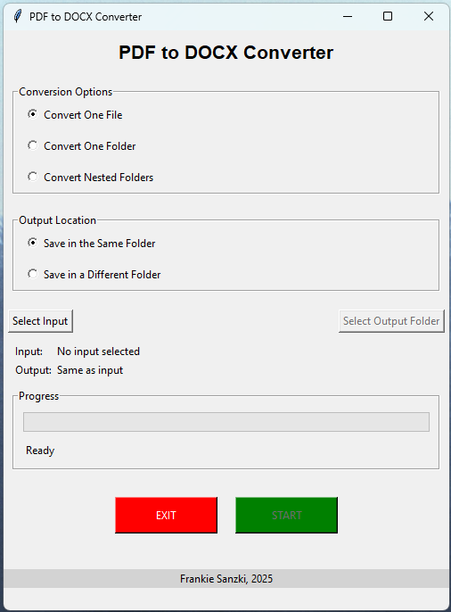

# PDF to DOCX Converter

A simple, portable application that converts PDF files to DOCX format with a user-friendly GUI.



## Features

- **Convert Single Files**: Convert a single PDF file to DOCX format
- **Convert Folders**: Convert all PDF files in a selected folder
- **Convert Nested Folders**: Convert all PDF files in a folder and its subfolders
- **Output Options**: Save to the same folder or specify a different output location
- **Progress Tracking**: Real-time progress bar shows conversion status with file-by-file updates
- **Simple Interface**: *Not so* User-friendly GUI with straightforward controls
- **Portable**: Single executable file that runs without installation

## Download

You can download the latest WINDOWS version of the application from the [Releases](../../releases) section of this repository.

## How to Use

1. Launch the application by double-clicking the executable file
2. Select one of the conversion options:
   - **Convert One File**: Convert a single PDF file
   - **Convert One Folder**: Convert all PDF files in a folder
   - **Convert Nested Folders**: Convert all PDF files in a folder and its subfolders
3. Choose whether to save the converted files in the same location or a different folder
4. Click **Select Input** to choose your input file or folder
5. If you selected "Save in a Different Folder", click **Select Output Folder** to choose where to save the converted files
6. Click the green **START** button to begin the conversion process
7. Watch the progress bar to monitor the conversion process
8. When finished, a success message will appear
9. Click the red **EXIT** button to close the application when done

## Running from Source

If you prefer to run the application from source:

1. Clone this repository:
   ```bash
   git clone https://github.com/frankie783/pdf-to-docx-converter.git
   cd [pdf-to-docx-converter]
   ```

2. Create a virtual environment (optional but recommended):
   ```bash
   python -m venv venv
   
   # On Windows:
   venv\Scripts\activate
   
   # On macOS/Linux:
   source venv/bin/activate
   ```

3. Install dependencies:
   ```bash
   pip install pdf2docx
   ```

4. Run the application:
   ```bash
   python pdf_converter.py
   ```

## Building the Executable

To build the executable yourself:

1. Make sure you have Python installed
2. Run the build script:
   ```bash
   python build.py
   ```

3. The executable will be created in the `dist` folder

## Cross-Platform Builds

The application is designed to work on Windows, macOS, and Linux. However, PyInstaller creates executables specific to the operating system it's running on:

- On Windows, it creates a `.exe` file
- On macOS, it creates a `.app` bundle
- On Linux, it creates a binary executable

To create executables for all platforms, you would need to run the build script on each target platform.

## Requirements

- Python 3.6+
- pdf2docx
- tkinter (included with Python)

## Technical Details

- **PDF Conversion**: Uses the pdf2docx library for high-quality conversion
- **Interface**: Built with Tkinter for a native look and feel
- **Multi-threading**: Performs conversion in a background thread to keep the UI responsive
- **Progress Tracking**: Real-time updates showing conversion progress
- **Packaging**: PyInstaller bundles everything into a single, portable executable

## License

[MIT License](LICENSE)

## Credits

Created by Frankie Sanzki, 2025
